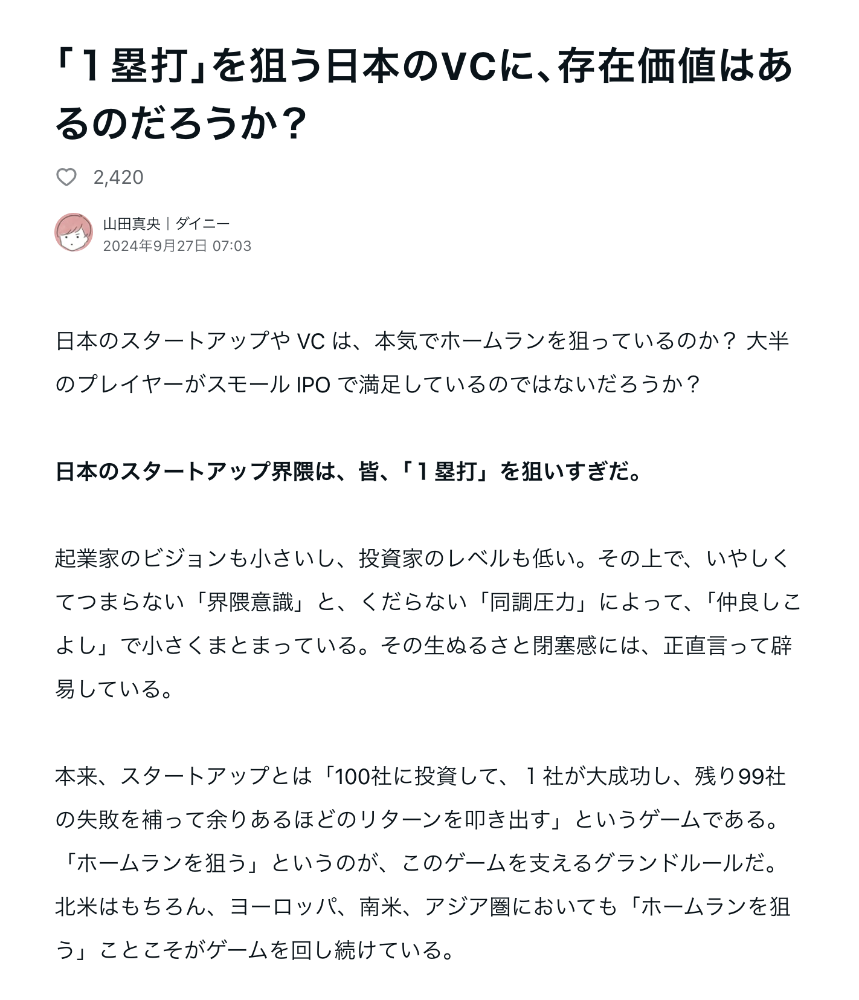

# THE YOT

---

## 🚨 注意事項

今回の発表資料・発言内容は、すべてフィクションです。

実在の人物、団体、企業、及びその方針・見解などとは一切無関係です。

---

# THE MODEL

- 言わずと知れた SaaS のモデル

- リード？FS？MRR？ARR？

- 前職はリアルの世界を相手に働いていた。私個人にはこの辺りの概念が無かった。（休み中にこそ勉強した）
- リアルの世界の営業プロセスは？そう **YOT** です。

---

## What is YOT?

- Yus⚪︎ri 👿
- Od⚪︎shi 👿👿
- Tak⚪︎ri 👿👿👿

---

## What is YOT?

- ⚪︎⚪︎⚪︎⚪︎⚪︎の方が安いだろ。うちも卸値を下げろ 👿
    - リベートを獲得する。
- 一緒に米に来ないと取引をやめるぞ 👿👿
    - CES（世界最大級のテック見本市）や NRF（世界最大級の小売業界向けカンファレンス）に連れて行く。
- 棚割りから外すぞ 👿👿👿
    - Buying power を武器にいい条件を引き出す。飲料で言えば、コンビニ3社に次ぐ規模。

---

## Every Day Low Price（EDLP）

- Retail は利益率がとにかく低い。3％あればいい方
- だから、どうやっても売上を上げるしかない
- 売り上げを上げるには、安く売るしかない
- だから、どうやっても仕入れを安くしないといけない
- 当然、システムも安く運用しないといけない

---

## Low Cost Operation

全て内製化 or OSS Self-hosting

- データセンター
    - 廃校が近隣にあったので、そこを借りてデータセンターを構築したらどうか。
    - コンテナが物流センターにあるので、データセンターに転用したらどうか。
- BI 📊
    - BI エンジンを自社で内製化。Big⚪︎uery と戦おうとしたが...

---

- Digital Signage 📺
    - 店舗を広告媒体として活用することで、広告費を呼び込む。
    - 数百台の Raspberry Pi とディスプレイを店舗に設置して、リモートでコンテンツを更新する。
    - サイネージの店舗への設置からハードウェア、ソフトウェア、コンテンツの制作まで全て内製化。声優も動画制作も社員。
- POS
    - 顧客の ID と購買行動を結びつけるため、POS システムも自社開発。
- ERP
    - SAP は高い。自社で開発するしかない。

---

- Cashless App 📱
    - クレジットの手数料を削減するため、自社でアプリを開発。
    - ネイティブアプリ、バックエンド、全銀システムの連携（口座引落）まで全て内製化。
    - 負荷試験を人手で行う。「せーの」の掛け声で負荷をかける。考えてみると一番エモい？瞬間だった。
- Shopping Cart 🛒
    - アプリストアを使わず自社で配信。数万台のカートを製造。MongoDB の Hosting も自社で行う。

etc...

---

## Episode 1: コンビニエンスストア 🏪

遥か彼方の銀河系で...
目に見えない敵、COVID ウイルスが銀河を襲い、人々は家に閉じこもることを余儀なくされていた。
混乱の中、若きジ⚪︎ダイ・マスター、スカ⚪︎ウォーカーは、古い配送システムの限界を感じていた。
銀河の片隅で急成長を遂げていた Uber Eats 連合。
その姿を目にしたスカ⚪︎ウォーカーは、フォースが導く新たな道を見出す。
「これこそが、われわれが求めていた答えだ」
「**ラスト⚪︎ンマイル**」と呼ばれる新たな配送システムの構築する。

---

## アクト 2

ある日、銀河貿易連合から使者が訪れる。
「我々の商品を、あなたのシステムで配送してほしい」
スカ⚪︎ウォーカーは瞑想の末、「**フル・ターン・⚪︎ー**」という新たなビジネスモデルを構築。
それは銀河の各惑星で「**Powerd By YOT**」という新型店舗の展開を可能にする革新的なシステムだった。
しかし、栄光の裏で、小売オーナーたちの散財という暗い影が忍び寄っていた。
フォースの暗黒面に落ちる者も現れ始めていた。

---

## アクト 3

銀河系辺境の惑星で、人手不足により次々と閉鎖されるコンビニエンス・ストア。
その光景は、スカ⚪︎ウォーカーの心に新たなビジョンを呼び覚ます。
「人の手に頼らない、新たな時代の店舗を」
瞑想を重ねた末、スカ⚪︎ウォーカーは「**無⚪︎店舗**」というフォースの新たな使い方を見出す。
それは、銀河の商業を根本から変える可能性を秘めていた。

この物語は、リテール テック革命の始まりに過ぎない。
銀河の秩序を守るため、革新の戦いは続く...

---

## ~~（次回予告）~~
~~エピソード 2：サ⚪︎ソンの帰還~~

---

ゾンビ企業の存在が生産性を下げる。労働生産性を上げるためには、ゾンビ企業を排除する必要がある。

---

単打狙いのバッターは、ホームランを打てる可能性は低い。

https://note.com/maochil/n/nd25fab444e70

---

## （次回予告）進撃の YOT 🧌

地域の寡占化を目指す。ムリ・ムダ・ムラを排除する。

---

既存事業と新規事業のバランス。ジェフリー・ムーアに師事する。

---

全員経営陣という思想。

---

## 永⚪︎五訓

組織が大きくなれば、1ミリのズレが大きな差になる。

価値基準を共有することを重要視する。

創業者が **MVV** にこだわる理由。

---

<!--
_backgroundColor: #f04600
-->

- 決まったら迷うことなく絶対実行。
    ### Take Ownership / Playful Challenge
- 言うべき事は言う。聞くべき事は聞く。領海侵犯しろ。
    ### Integrity Driven / Beyond Boundaries

---

ご清聴ありがとうございました。
